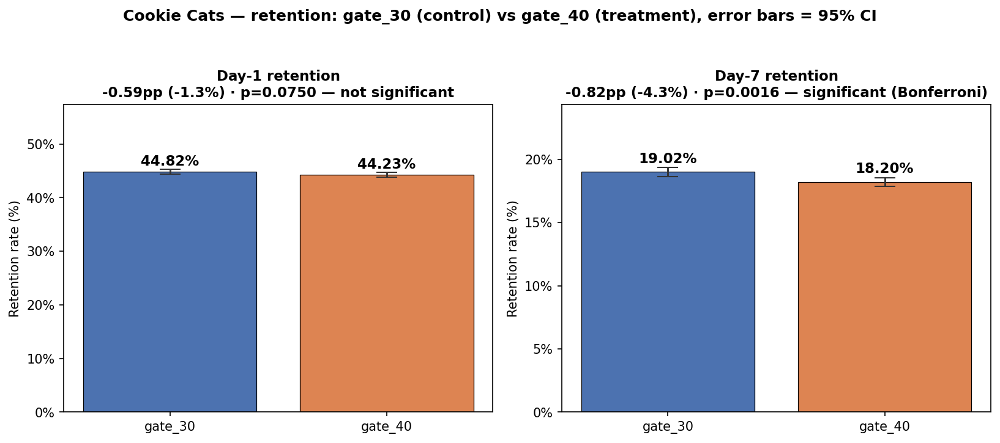
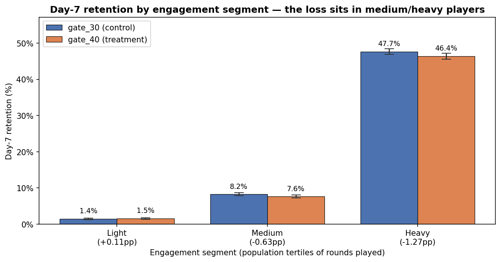
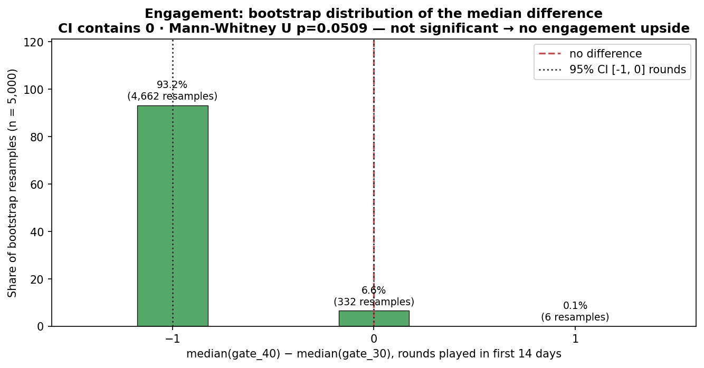

# Cookie Cats — Mobile Game A/B Testing

**English** · [Tiếng Việt](README.vi.md)

A/B test analysis for the puzzle game **Cookie Cats** (Tactile Entertainment): does **moving the progression gate from level 30 to level 40** improve player retention and engagement? Run end to end on the **CRISP-DM** process, from business framing to a Go/No-Go recommendation.

---

## Recommendation: NO-GO — keep the gate at level 30

> Do not roll out gate 40. Confidence > 95%, three independent lines of evidence.

| Evidence | Result |
|---|---|
| **Day-7 retention** | **−0.82pp (−4.3%)**, χ² with Yates correction, **p = 0.0016** — significant even against the Bonferroni threshold α = 0.0167 |
| **Engagement** | **No difference** — median 17 vs 16 rounds, Mann-Whitney **p = 0.051**, bootstrap 95% CI of the median difference contains 0 → no upside to trade the retention loss for |
| **Business impact** | **≈ 818 D7 users lost/month per 100K installs ≈ $2,454/month ≈ $29,448/year** (proxy at ARPDAU $0.10, linear with traffic) |

The damage is concentrated in **medium and heavy players** (−0.63pp and −1.27pp on D7) — the segment that actually generates value — while light players are unaffected (+0.11pp). Moving the gate later breaks the return habit of exactly the players worth keeping.

📄 **One-page executive summary:** [PDF](reports/CookieCats_Executive_Summary.pdf) · [HTML](https://xuanquang2103.github.io/CookieCats-Project/reports/CookieCats_Executive_Summary.html)

---

## The three charts that carry the argument

**1. Retention by test group** — D1 is a wash, D7 drops significantly.



**2. Day-7 retention by engagement segment** — the loss is not spread evenly; it lands on medium/heavy players.



**3. Bootstrap distribution of the engagement median difference** — the 95% CI contains 0, so there is no engagement gain to justify the retention loss.



All three are regenerated from source with `python scripts/export_figures.py`.

---

## Business question

> Does moving the gate 30 → 40 improve **player retention** (D1, D7) and **engagement**? → a **Go / No-Go** recommendation for the Product team.

## Dataset

- **Source:** Kaggle — *Mobile Games A/B Testing: Cookie Cats* (Tactile Entertainment via DataCamp)
- **Scale:** 90,189 raw rows → **90,188 users** after the dedup and outlier policy
- **Randomisation check:** SRM test passes (49.56% / 50.44%, p ≥ 0.001)

| Field | Meaning |
|---|---|
| `userid` | Unique player ID |
| `version` | Test group: `gate_30` (control) / `gate_40` (treatment) |
| `sum_gamerounds` | Rounds played in the first 14 days |
| `retention_1` | Returned after 1 day (0/1) |
| `retention_7` | Returned after 7 days (0/1) |

> ⚠️ The data file (`data/*.csv`) is not committed. Download the original dataset from Kaggle and place it in `data/`.

## Method

- **Hypotheses** — H0₁: D1 retention equal · H0₂: D7 retention equal · H0₃: median `sum_gamerounds` equal
- **Tests** — χ² test of independence with Yates correction for the two retention metrics; Mann-Whitney U for engagement (heavily right-skewed distribution, so no normality assumption)
- **Multiple testing** — α = 0.05 with a Bonferroni correction to α = 0.0167 across the 3 simultaneous tests
- **Beyond the p-value** — Cohen's h effect size, 95% CI on the difference, 5,000-resample bootstrap, and a segment cut by engagement tertile, so the conclusion rests on practical and not just statistical significance

## Repository structure

```
.
├── data/          # Dataset (CSV — gitignored)
├── docs/          # Data dictionary, decision log (14 ADR), checklists, glossary
├── notebooks/     # Jupyter notebooks by CRISP-DM phase
├── reports/       # Word reports, executive summary (HTML + PDF), figures/
├── scripts/       # Raw CSV → SQL Server loader, figure export
├── sql/           # Idempotent SQL for data preparation
├── PROJECT_CONTEXT.md
├── requirements.txt
└── README.md
```

Files suffixed `.vi` / `_vi` are the Vietnamese version of the same document.

## Tech stack

- **Python** — pandas, numpy, scipy.stats, matplotlib, seaborn
- **SQL** — SQL Server (schema + mart build, idempotent scripts with an audit trail)
- **Notebook** — Jupyter
- **Docs** — Word report per phase, decision log in ADR format

## Roadmap (CRISP-DM)

| Phase | Content | Status |
|---|---|---|
| 1 | Business Understanding | ✅ Done |
| 2 | EDA + data quality (SRM check, outliers, distributions) | ✅ Done |
| 3 | Data preparation (SQL) | ✅ Done |
| 4 | Analysis (hypothesis tests, bootstrap, segments) | ✅ Done |
| 5 | Visualization | ⏭️ Power BI dashboard dropped (static data — see DEC-13); reports instead |
| 6 | Insights & recommendation | ✅ Done |
| 7 | Delivery & documentation | ✅ Done |

## Deliverables

| Type | File |
|---|---|
| Executive 1-pager (Go/No-Go) | [`reports/CookieCats_Executive_Summary.pdf`](reports/CookieCats_Executive_Summary.pdf) |
| Report — analysis | [`reports/CookieCats_Phase4_Hypothesis_Testing_Report.docx`](reports/CookieCats_Phase4_Hypothesis_Testing_Report.docx) |
| Report — insights & recommendation | [`reports/CookieCats_Phase6_Insights_Recommend_Report.docx`](reports/CookieCats_Phase6_Insights_Recommend_Report.docx) |
| Report — EDA / data prep | [`reports/CookieCats_Phase2_EDA_Data_Quality_Report.docx`](reports/CookieCats_Phase2_EDA_Data_Quality_Report.docx) · [`reports/CookieCats_Phase3_DataPrepare_Report.docx`](reports/CookieCats_Phase3_DataPrepare_Report.docx) |
| Project closeout | [`reports/CookieCats_Phase7_Closeout-Report.docx`](reports/CookieCats_Phase7_Closeout-Report.docx) |
| Notebooks — EDA | `notebooks/phase2_00` → `phase2_04` |
| Notebooks — analysis | `notebooks/phase4_01_retention_hypothesis_test` · `phase4_02_engagement` · `phase4_03_segment_analysis` · `phase4_04_business_impact` |
| SQL (idempotent) | `sql/phase3_load_raw_bulk_insert.sql` → `phase3_00_create_metadata.sql` → `phase3_01_build_mart_ab_test_base.sql` → `phase3_02_validation_queries.sql` |
| Decision log (14 ADR) | [`docs/decision_log.md`](docs/decision_log.md) |
| Data dictionary · preprocessing checklist | [`docs/data_dictionary.md`](docs/data_dictionary.md) · [`docs/preprocessing_checklist.md`](docs/preprocessing_checklist.md) |

## Reproducibility

```bash
python -m venv .venv
.venv\Scripts\activate            # Windows
pip install -r requirements.txt   # versions are pinned
```

1. Download `cookie_cats.csv` from Kaggle and place it in `data/` (gitignored).
2. Create a `.env` in the repo root:
   ```
   DB_SERVER=localhost\SQLEXPRESS
   DB_NAME=cookie_cats
   DB_DRIVER=ODBC Driver 17 for SQL Server
   DB_TRUSTED_CONNECTION=yes
   ```
3. Load the raw CSV into `dbo.raw_ab_test` — `python scripts/load_raw_to_sqlserver.py` (it verifies the file MD5 against the provenance hash recorded in Phase 3; `sql/phase3_load_raw_bulk_insert.sql` is the T-SQL-only alternative).
4. Run the SQL in order — `phase3_00` → `phase3_01` → `phase3_02` — to build `cookie_cats.mart_ab_test_base`.
5. Run the notebooks in phase order. They read from SQL Server and fall back to the CSV, replicating the same mart policy, if no database is configured — so the analysis reproduces either way.
6. Regenerate the README figures — `python scripts/export_figures.py`.

## Further reading

[`PROJECT_CONTEXT.md`](PROJECT_CONTEXT.md) for scope, assumptions, stakeholder mapping and the terminology glossary · [`docs/decision_log.md`](docs/decision_log.md) for the 14 decisions and the reasoning behind each · [`docs/maintenance_notes.md`](docs/maintenance_notes.md) for repository housekeeping.

## License

[MIT](LICENSE) — analysis and code. The dataset belongs to its original authors on Kaggle.
